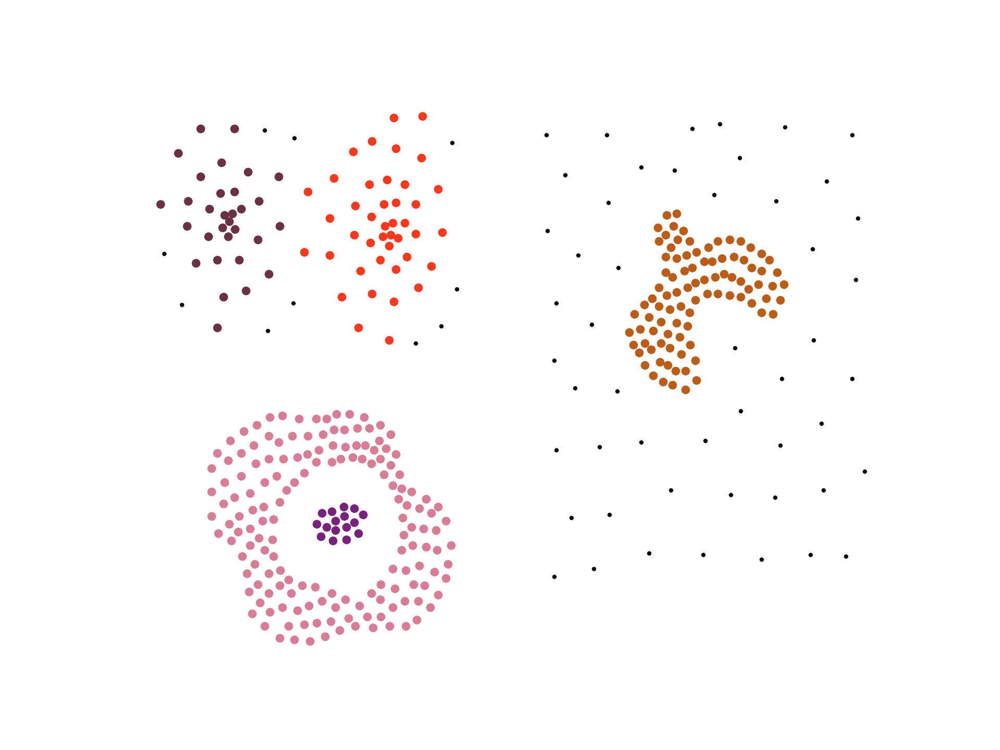
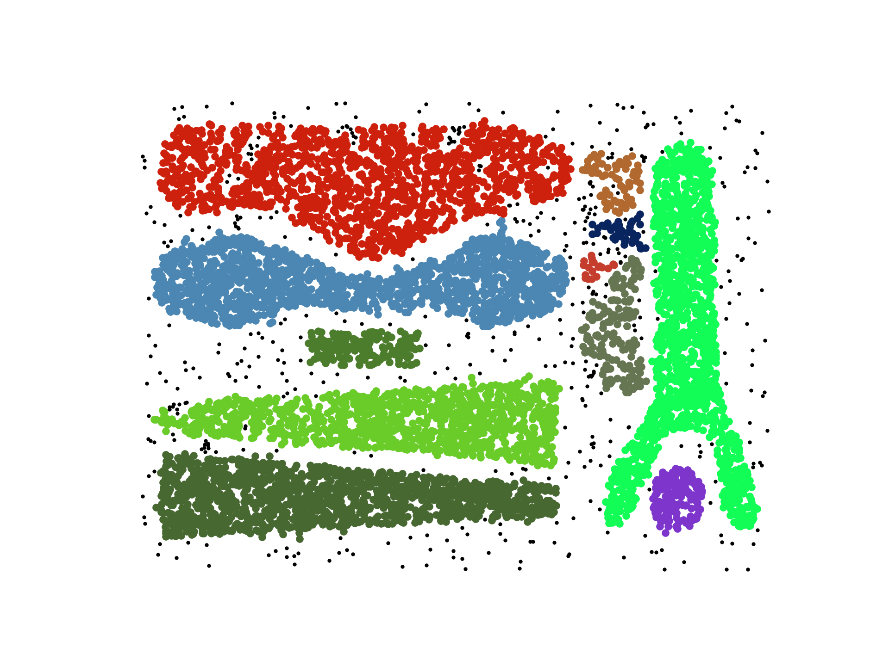

# cutESC
CutESC: Cutting Edge Spatial Clustering Technique based on Proximity Graphs

The CutESC algorithm removes edges when a dynamically calculated cut-edge value for the edge's endpoints is below a threshold. The dynamic cut-edge value is calculated by using statistical features and spatial distribution of data based on its neighborhood. Also, the algorithm works without any prior information and preliminary parameter settings while automatically discovering clusters with non-uniform densities, arbitrary shapes, and outliers. But there is an option which allows users to set two parameters to adapt clustering for particular problems easily.




## Dependencies

* Coded in Python 3.x.
* Using [Anaconda](https://www.continuum.io/downloads) is recommended.
* See [`requirements.txt`](requirements.txt) for a full list of requirements. Most of these are easy to get through pip, e.g.:
```bash
$ pip install -r requirements.txt
```
* To install `jqmcvi` library, go to https://github.com/jqmviegas/jqm_cvi

If you use this code, please cite the following [paper](https://www.sciencedirect.com/science/article/pii/S0031320319302468):

```
@article{aksac2019cutesc,
  title={CutESC: Cutting Edge Spatial Clustering Technique based on Proximity Graphs},
  author={Aksac, Alper and {\"O}zyer, Tansel and Alhajj, Reda},
  journal={Pattern Recognition},
  year={2019},
  publisher={Elsevier}
}
```
